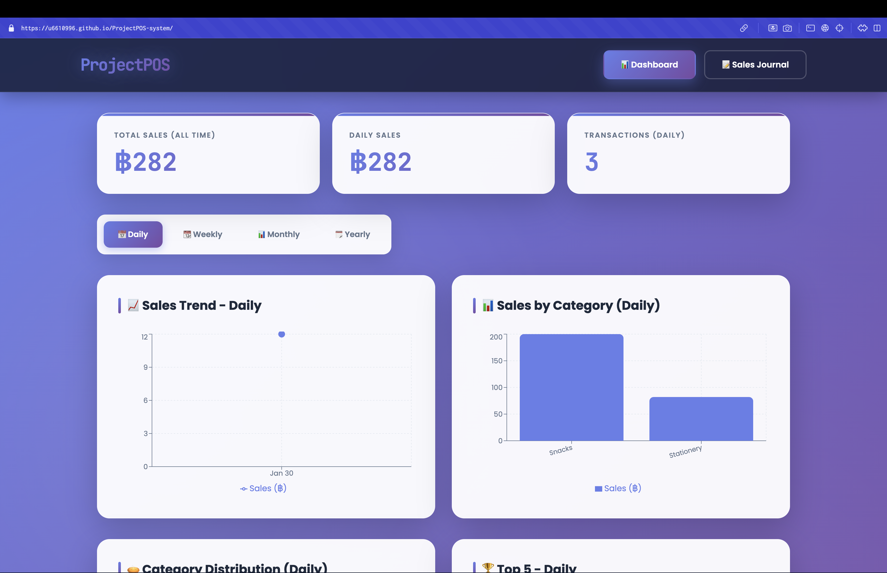
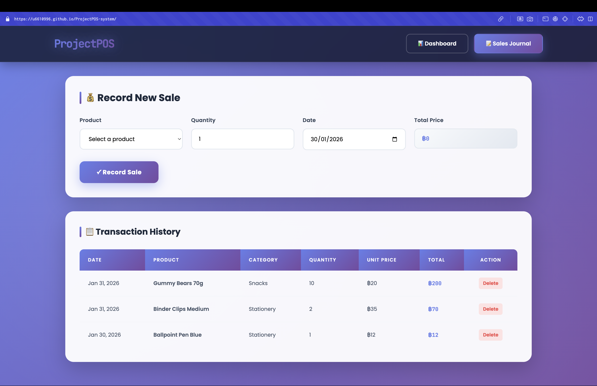

# ProjectPOS - Point of Sale System 🏪
https://u6610996.github.io/ProjectPOS-system/

## 👥 Team Members

- RATCHANON PUWAPATTARAPOKIN
- WORACHAI ARANCHOT

---

## 📸 Screenshot





---

## 🎯 Grading Criteria Checklist

- ✅ **GitHub Repo Source Code**: Complete React source with proper structure
- ✅ **Well-Formatted README**: Comprehensive documentation with screenshots
- ✅ **Deployment**: GitHub Pages deployment with live URL
- ✅ **UI as Designed**: Clean, professional interface matching requirements
- ✅ **Additional Design**: Modern glassmorphism, animations, responsive design
- ✅ **Correct Input Functionality**: Product selection, quantity, date, total calculation
- ✅ **Correct Journal Functionality**: Transaction recording and history display
- ✅ **Expense Calculation**: Automatic total calculation (Price × Quantity)
- ✅ **Extra Category Support**: All 5 product categories supported
- ✅ **Meaningful Line Chart**: 30-day sales trend visualization
- ✅ **Meaningful Bar Chart**: Sales comparison by category

---

## 📦 Installation Guide

### Prerequisites
- Node.js (v16 or higher)
- npm or yarn
- Git

### Step 1: Clone Repository
```bash
git clone https://github.com/[your-username]/ProjectPOS-system.git
cd ProjectPOS-system
```

### Step 2: Install Dependencies
```bash
npm install
```

### Step 3: Run Development Server
```bash
npm run dev
```

### Step 4: Build for Production
```bash
npm run build
```

---

## 🔧 Development Commands

```bash
# Install dependencies
npm install

# Start development server
npm run dev

# Build for production
npm run build

# Preview production build
npm run preview

# Deploy to GitHub Pages
npm run deploy
```
